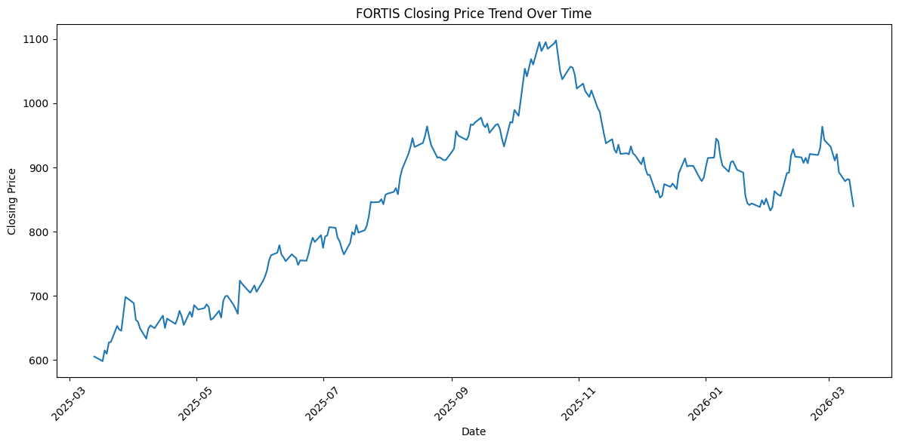
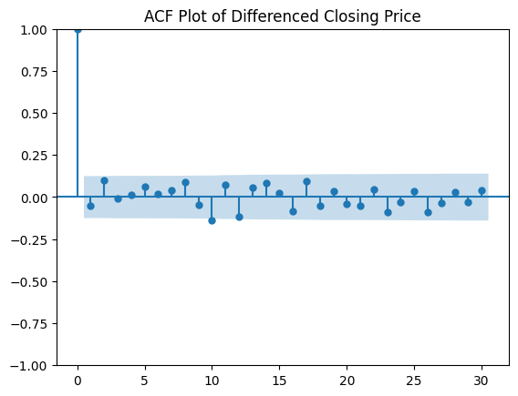
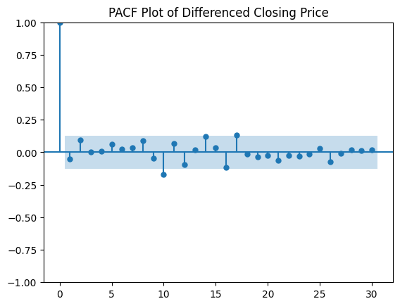
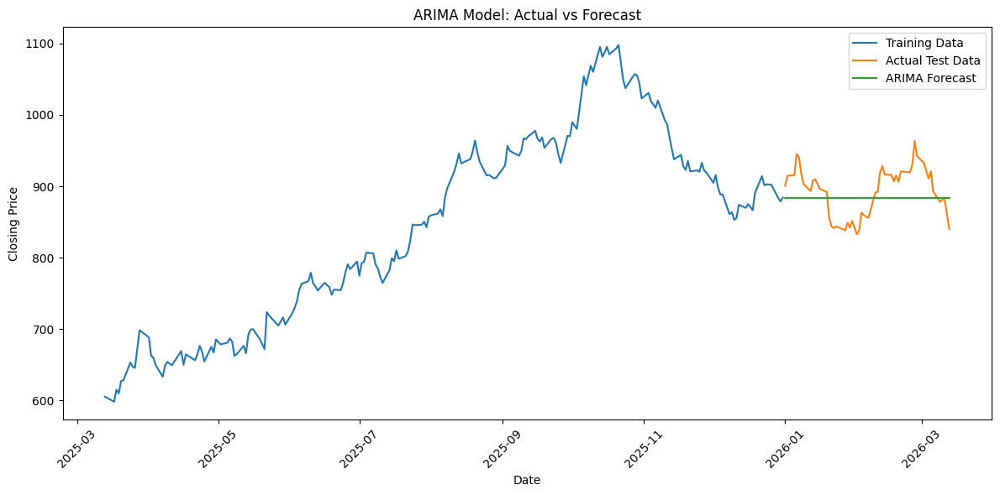
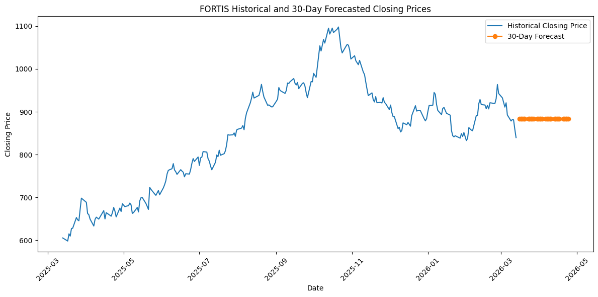

# FORTIS Stock Price Analysis and Forecasting using ARIMA

## Project Overview
This project analyzes historical stock price data of **FORTIS** and applies the **ARIMA time series model** to forecast future closing prices. The work was completed as part of a university assignment in **Data Analytics**.

The objectives of this project were to:
- preprocess stock market data,
- visualize the historical closing price trend,
- test for stationarity using the ADF test,
- analyze ACF and PACF plots,
- build an ARIMA model,
- forecast the next 30 days of closing prices,
- interpret the forecasting results.

---

## Dataset
- `data/Quote-Equity-FORTIS-EQ-13-03-2025-13-03-2026.csv`
- **Stock:** FORTIS
- **Source Format:** CSV
- **Date Range:** 13-Mar-2025 to 13-Mar-2026

## Graphs

